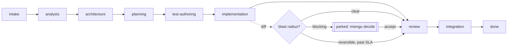
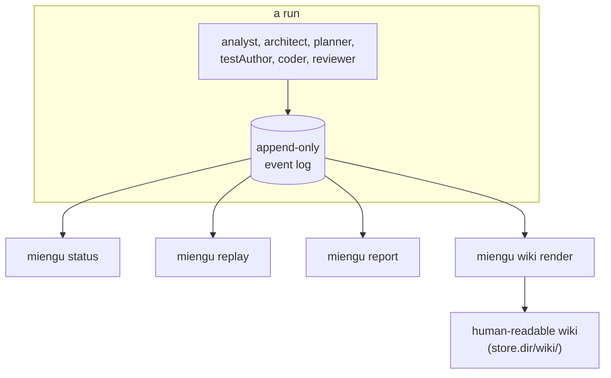

# Miengu

Miengu drives a target git repository through a fixed pipeline of coding agents and stops for a
human only when a change is irreversible, touches a sensitive or externally-contracted surface,
or exceeds a declared diff size. Every decision it makes — which stage runs next, whether a
change blocks — is re-derived from an append-only event log, never from an agent's self-reported
confidence, so a run is replayable and its state is always reconstructible from disk.



## Requirements

- Node.js 20+
- `git`, with the target repository already cloned locally
- The CLI(s) for whichever executors you configure, authenticated and on `PATH`:
  [`claude`](https://github.com/anthropics/claude-code) (Claude Code) and/or
  [`codex`](https://github.com/openai/codex) (Codex CLI)

## Install

```sh
brew tap Jspascal/tap && brew install miengu
```

or

```sh
curl -fsSL https://github.com/Jspascal/miengu/releases/latest/download/miengu-install.sh | sh
```

To build from source instead, see [Building from source](#building-from-source).

## Quickstart

```sh
# 1. Scaffold a config next to (not inside) the repo you want miengu to work on.
miengu init --target ../some-project

# 2. Edit miengu.config.yaml — see the annotated example below.

# 3. Write what you want built as a plain-text or Markdown PRD.
$EDITOR feature.prd.md

# 4. Run it.
miengu run feature.prd.md
```

Each PRD becomes one work item, identified by a slug of its filename (`feature.prd.md` →
`feature`). `run` also drains any other parked item whose blocking condition has cleared — pass
`--no-backlog` to process only the new item. A run that hits a gate parks the item and exits
non-zero rather than guessing.

### Live terminal view

`miengu run feature.prd.md` opens a dashboard automatically when stderr is an interactive
terminal. It shows the current stage and agent, elapsed time, time since the last output,
tool activity, replies, and any reasoning text or summaries the provider exposes in its
public CLI stream. Hidden internal reasoning is not available. Output appears as each
provider emits its messages; this is not a token-by-token view.

Use Up/Down or Page Up/Page Down to scroll, End to follow live output, and Ctrl-C to stop
the run. The dashboard retains the most recent 5,000 lines; raw provider stdout is saved
to the transcript path shown when an agent returns. Failure messages include provider
errors, exit status, and the transcript location. Transcript-save failures are reported
as errors instead of leaving the run pending.

Use `--no-tui` for a plain live feed with normal terminal scrollback. Redirected output
automatically uses that format; `--json` suppresses the live view and retains the existing
machine-readable result. The terminal is restored on completion or error.

## Config, by example

`miengu init` writes the full annotated file — [`miengu.config.example.yaml`](./miengu.config.example.yaml)
is that same template. The pieces that matter most day to day:

```yaml
target:
  repo: ../some-project      # the repository miengu operates on
  mode: worktree              # runs happen in a disposable git worktree, not your checkout

# Quota pools. Every executor instance below must name one of these.
accounts:
  claude-personal:
    maxTurnsPerItem: null      # null = unlimited; set a ceiling to cap spend per item
    maxUsdPerItem: 20

# Named executor instances. args/env safely replace shell aliases (which Node cannot see).
# Codex runs ignore unrelated user config/MCP servers; CODEX_HOME authentication remains active.
executors:
  cc-sonnet:
    type: claude-code
    bin: claude
    env: { CLAUDE_CONFIG_DIR: "${HOME}/.claude-work" }
    model: sonnet
    effort: medium
    account: claude-personal
  cc-opus:
    type: claude-code
    bin: claude
    env: { CLAUDE_CONFIG_DIR: "${HOME}/.claude-work" }
    model: opus
    effort: high
    account: claude-personal
  cx-sol: { type: codex, model: gpt-5.6-sol, effort: high, account: codex-personal }

# Roles reference an executor instance. Turns and context budget live here.
roles:
  architect: { executor: cx-sol,    maxTurns: 12, contextBudgetTokens: 90000 }
  coder:     { executor: cc-sonnet, maxTurns: 60, contextBudgetTokens: 60000 }
  reviewer:  { executor: cc-opus,   maxTurns: 10, contextBudgetTokens: 50000 }

# Oracles the coder's work is actually checked against — wire up your real commands.
oracles:
  build:     "npm run build"
  test:      "npm test"
  lint:      "npm run lint"
  typecheck: "npm run typecheck"

# Gates: an undeclared surface is an ungated surface, on purpose. miengu never infers one.
checkpoints:
  blastRadius:
    sensitivePaths: ["**/auth/**", "**/permissions/**", "**/payment*/**", "**/billing/**"]
    externalContractPaths: ["**/openapi*.y*ml", "**/*.proto", "**/public-api/**"]
    maxDiffLines: 400
    maxFilesTouched: 20
    severity:
      sensitive-surface: blocking   # always waits for miengu decide
      diff-size: advisory           # auto-approves after its SLA if nobody responds
```

A minimal PRD is just prose — miengu's analyst turns it into scoped tasks:

```markdown
# Add rate limiting to the public API

Requests to /api/* should be limited to 100/minute per API key, returning 429 with a
Retry-After header once exceeded. Reuse the existing Redis client in src/cache.ts.
```

## Commands

| Command | Does |
|---|---|
| `miengu init [dir]` | Writes an annotated `miengu.config.yaml` into `dir` (default cwd). `--target <path>` sets the repo it points at; `--force` overwrites. |
| `miengu run <prd-file>` | Runs the PRD as a new work item, then drains the backlog. `--retain-workspace` keeps the worktree instead of removing it on exit; `--no-backlog`; `--json`. |
| `miengu status` | Every item's stage, status, and any open checkpoints with their owner, SLA, and default. |
| `miengu report [--since <date>]` | The batch review report across items, optionally filtered to those updated since a date. |
| `miengu replay <item>` | Re-derives and prints an item's current state by replaying its event log — the same projection `status` uses, for one item. |
| `miengu decide <checkpoint> <accept\|reject>` | Resolves an open checkpoint. `--reason <text>`; `--item <id>` to disambiguate a checkpoint id that exists in more than one item. |
| `miengu wiki render` | Regenerates the human-readable wiki (`<store.dir>/wiki/`) from the log. |

Every command accepts `--config <path>` (default `./miengu.config.yaml`) and `--json` for
machine-readable output. `miengu status --json` on a parked item looks like:

```json
{
  "itemId": "add-rate-limiting",
  "stage": "implementation",
  "status": "parked",
  "park": {
    "reason": "awaiting-human",
    "detail": "sensitive-surface: src/auth/apiKey.ts",
    "account": null,
    "resetsAt": null
  },
  "openBlockingCheckpoints": 1,
  "backlog": { "ready": false, "blocker": "blocking-checkpoint-open" }
}
```

```sh
miengu decide cp-add-rate-limiting-1 accept --reason "reviewed the key-lookup change by hand"
miengu run feature.prd.md   # resumes it on the next drain
```

## How state actually works



State lives under `store.dir` (default `.miengu/`) as one append-only event log per work item.
`status`, `replay`, and `report` are pure projections over that log — never a second source of
truth — and `wiki render` turns the same log into a browsable human view. Before any agent
touches the repo, brownfield collectors (`brownfield:` in config, on by default) gather real
scope, git history, and existing tests from an immutable pinned checkout, so planning and review
are grounded in what the repo actually contains, not in what an agent assumes it contains.

## Exit codes

| Code | Meaning |
|---|---|
| 0 | OK |
| 1 | Internal error |
| 2 | Usage error |
| 3 | Config error |
| 4 | Store error (e.g. a corrupt event log) |
| 5 | Lock already held |
| 6 | Item parked (a checkpoint gate awaiting `miengu decide`, a quota window, or another park condition) |
| 7 | Replay mismatch |
| 10 | Not implemented |

## Building from source

```sh
npm ci
npm run build
node dist/cli/index.js --help
```

`npm link` afterwards to get a local `miengu` on `PATH`.
